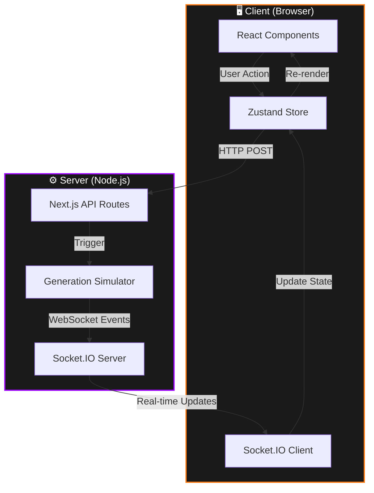

# 🎵 MusicGPT — AI Music Generation Interface

A pixel-perfect, high-fidelity web application simulating an AI music generation platform with real-time WebSocket communication, advanced animations, and a premium dark-mode aesthetic.


---

## 📋 Table of Contents

- [Motive & Purpose](#-motive--purpose)
- [Architecture](#-architecture)
- [Tech Stack](#-tech-stack)
- [Getting Started](#-getting-started)
- [Project Structure](#-project-structure)
- [Features](#-features)
- [Implementation Details](#-implementation-details)
- [Development Guide](#-development-guide)

---

## 🎯 Motive & Purpose

### Why This Project Exists

MusicGPT demonstrates **enterprise-grade frontend engineering** through a production-quality simulation of an AI music generation platform. It showcases:

1. **Pixel-Perfect Design Implementation** — Translating complex design systems into production code with exact fidelity
2. **Advanced Animation Engineering** — Creating fluid, performant micro-interactions using Framer Motion
3. **Real-Time State Management** — Orchestrating WebSocket events with optimistic UI updates
4. **Modern React Architecture** — Leveraging Next.js 15+ App Router with TypeScript and Zustand

### Problem Solved

Traditional portfolio projects often lack:

- Production-quality polish
- Complex state management scenarios
- Real-time communication patterns
- Advanced animation systems

This project fills that gap by implementing a **complete, production-ready interface** with sophisticated UX patterns found in modern SaaS applications.

### Target Audience

- **Engineering Teams** evaluating frontend architecture decisions
- **Designers** seeking reference implementations of complex interactions
- **Developers** learning advanced React patterns and animation techniques

---

## 🏗️ Architecture

### System Overview



### Data Flow

1. **User Input** → User types prompt in `PromptBox` and submits
2. **Optimistic Update** → `useGenerationStore` adds pending generation immediately
3. **API Call** → `POST /api/generate` creates server-side record
4. **WebSocket Stream** → Server emits progress events (`generation_start`, `progress`, `completed`)
5. **State Sync** → `useWebSocket` hook listens and updates Zustand store
6. **UI Reactivity** → Components auto-re-render based on store changes

### Key Design Decisions

| Decision                            | Rationale                                                   |
| ----------------------------------- | ----------------------------------------------------------- |
| **Zustand over Redux**              | Simpler API, less boilerplate, built-in TypeScript support  |
| **Socket.IO over plain WebSockets** | Auto-reconnection, room support, fallback transports        |
| **Custom Server**                   | Needed to run Socket.IO alongside Next.js                   |
| **Framer Motion**                   | Declarative animations, layout transitions, gesture support |
| **Tailwind v4**                     | CSS-first with `@theme`, faster builds, better DX           |

---

## 🛠️ Tech Stack

### Core Framework

- **Next.js 16.1** — React framework with App Router
- **React 19.2** — UI library with concurrent features
- **TypeScript 5** — Type safety and developer experience

### Styling & Animation

- **Tailwind CSS 4.1** — Utility-first CSS with custom design tokens
- **Framer Motion 11** — Production-ready animation library
- **Lucide React** — Beautiful, consistent icon set

### State & Communication

- **Zustand 4.5** — Lightweight state management
- **Socket.IO 4.7** — Real-time bidirectional communication
- **React Hooks** — Custom hooks for WebSocket, placeholders, etc.

### Developer Tools

- **ESLint 10** — Code linting
- **PostCSS + Autoprefixer** — CSS processing

---

## 🚀 Getting Started

### Prerequisites

- **Node.js** 18+ or **Bun** 1.0+
- **npm** or **bun** package manager

### Installation

```bash
# Clone the repository
git clone <repository-url>
cd musicgpt-app

# Install dependencies
npm install
# or
bun install
```

### Development

```bash
# Start development server (includes WebSocket server)
npm run dev
# or
bun run dev
```

Open [http://localhost:3000](http://localhost:3000) in your browser.

### Production Build

```bash
# Build for production
npm run build

# Start production server
npm start
```

---

## 📁 Project Structure

```
musicgpt-app/
├── app/                          # Next.js App Router
│   ├── layout.tsx               # Root layout with Sidebar
│   ├── page.tsx                 # Home page (redirects to /create)
│   ├── create/
│   │   └── page.tsx            # Main creation interface
│   └── api/
│       └── generate/
│           └── route.ts        # Generation API endpoint
│
├── components/
│   ├── features/
│   │   ├── create/             # Creation interface features
│   │   │   ├── PromptBox.tsx
│   │   │   ├── PromptToolbar.tsx
│   │   │   ├── PromptLyricsInput.tsx
│   │   │   ├── RecentGenerations.tsx
│   │   │   └── GenerationCard.tsx
│   │   ├── profile/            # Profile and Generation lists
│   │   │   ├── ProfilePopup.tsx
│   │   │   ├── ProfileHeader.tsx
│   │   │   ├── ProfileCredits.tsx
│   │   │   ├── ProfileGenerationList.tsx
│   │   │   └── ProfileAlerts.tsx
│   │   └── player/             # Molecular player components
│   │       ├── PlayerControls.tsx
│   │       ├── PlayerProgress.tsx
│   │       ├── PlayerVolume.tsx
│   │       └── PlayerTrackInfo.tsx
│   ├── layout/
│   │   ├── Sidebar.tsx         # Main left navigation container
│   │   ├── sidebar/            # Sidebar atomic components
│   │   │   ├── SidebarNav.tsx
│   │   │   ├── SidebarPromo.tsx
│   │   │   └── SidebarFooter.tsx
│   │   ├── TopBar.tsx          # Top header with notifications
│   │   └── FloatingPlayer.tsx  # Bottom audio player orchestrator
│   ├── shared/
│   │   └── AnimatedBorder.tsx  # Reusable circulating border effect
│   └── ui/                     # Atomic accessible UI components
│       ├── Button.tsx
│       ├── IconButton.tsx
│       └── Slider.tsx
│
├── hooks/
│   ├── useWebSocket.ts          # WebSocket connection manager
│   ├── useAudioPlayer.ts        # Centralized audio track logic
│   └── useCyclingPlaceholder.ts # Placeholder text animation
│
├── lib/
│   ├── socket.ts               # Socket.IO client instance
│   └── utils.ts                # Utility functions (cn, etc.)
│
├── store/
│   └── useGenerationStore.ts   # Global Zustand store
│
├── types/
│   └── generation.ts           # TypeScript interfaces
│
├── server.js                    # Custom server (Next.js + Socket.IO)
└── package.json
```

---

## ✨ Features

### 1. **Animated PromptBox**

The PromptBox uses a **two-phase animation system** that transitions between idle and focused states.

#### Phase 1 — Idle: Canvas Border Trace (`AnimatedBorder.tsx`)

When the box is **not focused**, a pure canvas animation paints a rotating conic gradient directly onto the border path using `requestAnimationFrame` at 60fps.

```
canvas → ctx.createConicGradient(angle, cx, cy)
       → ctx.strokeStyle = gradient
       → ctx.stroke() [rounded rect path]
       → angle += 0.01 per frame
```

The gradient carries a flowing orange/pink highlight with transparent gaps, creating a "light tracing the border" effect. A second softened `blur(8px)` pass adds a glowing halo to the stroke.

#### Phase 2 — Focused: CSS Outer Glow

When the textarea is focused, `AnimatedBorder` fades out (`opacity: 0`) and a simple CSS layer fades in:

```tsx
<div
  className="absolute -inset-1 rounded-4xl blur-3xl
     bg-linear-to-r from-[#fc7912] via-[#ff9a44] to-[#fc7912]
     opacity-40 scale-[1.02]"
/>
```

This creates a soft amber bloom radiating from beneath the box edges, and the physical `border` color transitions from `border-border-input` → `border-accent-orange/40`.

#### Cycling Placeholder

While unfocused and empty, placeholder text cycles through prompts using `useCyclingPlaceholder` — each swap is animated via `<AnimatePresence>` with a vertical slide (`y: 10 → 0 → -10`) and opacity cross-fade over `300ms`.

**Key files**: [`PromptBox.tsx`](components/features/create/PromptBox.tsx), [`AnimatedBorder.tsx`](components/shared/AnimatedBorder.tsx), [`useCyclingPlaceholder.ts`](hooks/useCyclingPlaceholder.ts)

### 2. **Real-Time Generation Tracking**

Simulates AI generation lifecycle:

- **States**: `pending` → `generating` → `completed` / `failed`
- **Progress Gradients**: Visual feedback with color-coded gradients (0%, 25%, 50%, 75%, 90%, 100%)
- **WebSocket Updates**: Server pushes progress events, client updates UI instantly
- **Error Handling**: "Server Busy" and "Invalid Prompt" states

**Implementation**: `store/useGenerationStore.ts`, `hooks/useWebSocket.ts`, `server.js`

### 3. **Profile Popup & Dry Component Architecture**

Floating dropdown utilizing strict SOLID/DRY principles:

- **GeneratingCard Singleton** — A singular source of truth for pending states sharing its animated SVG progress ring and background fill across all views.
- **Gradient Avatar Ring** — Orange → Pink → Purple
- **Credits Display** — Real-time credit balance with Top Up CTA
- **Alert System** — Elegant alert handlers for Insufficient Credits and Server warnings.

**Implementation**: `components/features/profile/ProfilePopup.tsx`, `ProfileGenerationList.tsx`

### 4. **Sidebar Navigation**

Premium sidebar with:

- **Search Bar** — `⌘ K` shortcut pattern
- **Active State Icons** — Filled icons for current route
- **Promo Card** — "Model v6 Pro" announcement with gradient
- **Footer Links** — Pricing, API, About, Terms, Privacy

**Implementation**: `components/layout/Sidebar.tsx`, `components/layout/sidebar/`

### 5. **Floating Player**

Persistent bottom player with advanced dragging mechanics:

- **Global State** — Survives navigation
- **Native Drag Mechanics** — Custom `Slider` UI component utilizing `PointerEvent` tracking (`onPointerDown/Move/Up`) for zero-latency, buttery smooth dragging of both playback timing and volume.
- **Responsive Layout** — Flawlessly aligns volume to the right on desktop, collapsing elegantly on mobile.
- **Placeholder Handlers** — Primed for Next/Previous tracks.

**Implementation**: `components/layout/FloatingPlayer.tsx`, `components/ui/Slider.tsx`

---

## 🔧 Implementation Details

### State Management

**Zustand Store** (`store/useGenerationStore.ts`) manages:

```typescript
interface GenerationStore {
  generations: Generation[];
  addGeneration: (prompt: string) => string;
  updateGeneration: (id: string, updates: Partial<Generation>) => void;
  currentTrack: Generation | null;
  isProfileOpen: boolean;
  // ... more state
}
```

Benefits:

- No Provider boilerplate
- Direct store access with hooks
- Middleware support (persist, devtools)

### WebSocket Integration

**Hook Pattern** (`hooks/useWebSocket.ts`):

```typescript
export function useWebSocket() {
  useEffect(() => {
    const updateGeneration = useGenerationStore.getState().updateGeneration;

    socket.on("generation_start", (data) => {
      updateGeneration(data.id, { status: "generating", progress: 0 });
    });

    socket.on("progress", (data) => {
      updateGeneration(data.id, { progress: data.progress });
    });

    // ... more handlers
  }, []);
}
```

Called once in `<Sidebar>` to establish global connection.

### Animation Strategy

**Canvas-Based Border** (`components/shared/AnimatedBorder.tsx`):

- Uses `requestAnimationFrame` for 60fps
- Conic gradient rotates around border path
- Opacity controlled by `active` prop

**Framer Motion Patterns**:

- `<AnimatePresence>` for mount/unmount
- `layout` prop for smooth position changes
- `whileHover` for interactive states

### Styling System

**Tailwind v4** with custom theme:

```css
@theme {
  --color-accent-orange: #fc7912;
  --color-bg-input: #161616;
  --font-size-xs: 0.7rem;
  /* ... 50+ design tokens */
}
```

Utilities:

- `cn()` from `clsx` + `tailwind-merge` for conditional classes
- Custom gradients via CSS variables

---

## 👨‍💻 Development Guide

### Adding a New Component

1. Create component in appropriate folder (`components/[category]/`)
2. Use TypeScript interfaces from `types/`
3. Access store with `useGenerationStore()`
4. Add Framer Motion for animations
5. Style with Tailwind utilities

### Styling Conventions

- Use design tokens from `app/globals.css` `@theme`
- Prefer `text-text-primary` over `text-white`
- Use `cn()` for conditional classes
- Keep component-specific styles in the component file

### WebSocket Events

Server emits:

- `generation_start` — Generation begins
- `progress` — Progress update (0-100)
- `completed` — Generation finished, includes audio URL
- `failed` — Generation failed, includes error

Client can emit:

- `retry` — Retry failed generation

### Testing Approach

- **Manual Testing**: Run dev server, interact with UI
- **Build Verification**: `npm run build` ensures TypeScript safety.
- **WebSocket Verification**: Chrome DevTools for WebSocket events mapping.

---

## 🗺️ Future Improvements Roadmap

To bring this interface into total enterprise-level maturity, the following areas are primed for expansion:

1. **Accessibility (A11y) Upgrades**:
   - While visually polished, custom interactive elements (like the `Slider.tsx`) require `aria-valuenow`, `role="slider"`, and `onKeyDown` handlers to support keyboard navigation (Left/Right arrow keys) for screen readers.
2. **Audio Playlist & Queue Management**:
   - The `FloatingPlayer` currently plays a single active track. Implementing a `trackQueue: Generation[]` array in the Zustand store would allow the Next/Previous buttons to cycle through the user's recent generations.
3. **Buffered Audio Representation**:
   - The custom slider supports a `buffer` prop, but `useAudioPlayer` currently does not extract `audioRef.current.buffered` arrays. Extracting this would allow the progress bar to show the classic light-grey downloaded buffer ahead of the playhead.
4. **Offline Resilience & Reconnection UX**:
   - The `Socket.IO` instance will auto-reconnect, but surfacing a tasteful "Reconnecting..." or offline toast notification when the `socket.on("disconnect")` event fires would improve mobile UX.
5. **Testing Suite Automation**:
   - The codebase currently lacks a testing runner. Introducing `Playwright` for E2E user flows (verifying the player drag and prompt submission) or `Vitest` for the Zustand store logic.
6. **Mobile Gesture Support**:
   - Integrating Framer Motion's `drag="y"` attribute on the `FloatingPlayer` to allow mobile users to swipe the player away (dismiss) down off the screen.

---

## 📝 License

This is a demonstration project. All rights reserved.

---

## 🙏 Acknowledgments

- **Design Inspiration**: Modern AI music platforms
- **Icons**: [Lucide](https://lucide.dev/)
- **Animations**: [Framer Motion](https://www.framer.com/motion/)

---

**Built with ❤️ and ☕ by a Senior Frontend Engineer**
